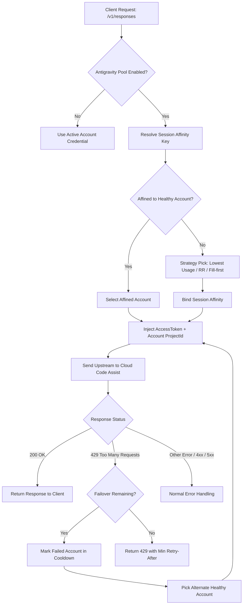

# Google Antigravity 账号池与自动切换设计规范 (Design Spec)

## 1. 背景与目标

### 1.1 现状
OpenCodex 目前对 Google Antigravity（Cloud Code Assist, CCA）支持多 OAuth 账号的存储、导入与手动切换，但运行时的模型请求仅绑定单一的活跃账号（`activeAccountId`）。当单个账号触发额度耗尽（Quota Exhausted）或遭遇 429 限流时，请求会直接失败或仅做同账号退避重试，无法利用已登录的其他健康账号。

### 1.2 目标
为 Google Antigravity 引入与 Anthropic OAuth 账号池平行的多账号自动切换机制：
1. **多账号配额探测**：支持并行探测所有已登录 Antigravity 账号的独立配额（含 Gemini 与 Claude/GPT-OSS 双家族）。
2. **用量感知路由**：新会话优先路由至用量最低（或低于 `autoSwitchThreshold`）的健康账号。
3. **会话亲和性 (Session Affinity)**：同一客户端会话（Thread/Session）保持在同一账号，保证多轮对话与推理签名（`thoughtSignature`）连续。
4. **429 故障转移 (Failover)**：请求遭遇 429 / RESOURCE_EXHAUSTED 时，自动将当前账号置入冷却（Cooldown），并在同一请求内无缝切换至下一个健康账号重试。

---

## 2. 架构设计与核心组件

### 2.1 整体架构流程



---

## 3. 详细模块设计

### 3.1 配置层 (`src/types.ts`)

在 `OcxConfig` 中增加 `antigravityAccountPool` 定义：

```ts
export interface AntigravityAccountPoolConfig {
  /** 是否启用账号池，默认 false */
  enabled?: boolean;
  /** 基于用量的自动切换阈值百分比 (0-100)，默认 80 */
  autoSwitchThreshold?: number;
  /** 选号策略："quota" (默认，最低用量), "round-robin", "fill-first" */
  strategy?: OcxAccountPoolRotationStrategy;
  /** round-robin 轮询策略下的粘性请求次数限制，默认 1 (1-100) */
  stickyLimit?: number;
}
```

并在 `src/config.ts` 的 schema 校验中增加对 `antigravityAccountPool` 的校验与安全合并逻辑。

---

### 3.2 多账号配额探测 (`src/providers/quota.ts`)

1. **放开 Provider 支持**：
   ```ts
   export function supportsPerAccountQuota(provider: string): boolean {
     return provider === "anthropic" || provider === "google-antigravity";
   }
   ```
2. **账号级配额探测实现**：
   - 在 `fetchAccountQuota` 中增加 `google-antigravity` 分支：
     - 使用 `getValidAccessTokenForAccount("google-antigravity", accountId)` 获取 Token。
     - 获取该账号凭证中的 `projectId`。
     - 调用 CCA `POST ${baseUrl}/v1internal:fetchAvailableModels`。
     - 解析返回模型列表中的配额数据，生成 `customWindows: [{ label: "Gem", percent, resetAt }, { label: "Cla", percent, resetAt }]`。
     - 存入 `accountQuotaCache`（缓存 TTL 为 5 分钟），并支持通过 `GET /api/oauth/accounts?provider=google-antigravity&quota=1` 返回前端展示。

---

### 3.3 账号池路由与容灾引擎 (`src/oauth/antigravity-routing.ts`)

新建模块，负责 Antigravity 专有的运行时状态机与选号算法：

1. **状态机维护**：
   - `upstreamHealth: Map<string, AccountHealth>`：记录冷却账号及截止时间（解析响应头 `Retry-After`，无 header 时默认 60s，上限 15 分钟）。
   - `sessionAffinity: Map<string, AffinityEntry>`：客户端会话标识（`clientThreadId` / `sessionId`）与账号的映射，TTL 24 小时，最大 2000 条。

2. **模型家族感知打分 (Family-Aware Usage Scoring)**：
   - 当请求模型属于 Gemini 系列（如 `gemini-3.1-pro`）时，取 `customWindows` 中 `label === "Gem"` 的 `percent`。
   - 当请求模型属于 Claude / GPT-OSS 系列（如 `claude-3.7-sonnet`）时，取 `customWindows` 中 `label === "Cla"` 的 `percent`。
   - 未知配额的账号打分为 100（避免新账号误判为耗尽，但优先使用已知健康低用量账号）。

3. **选号逻辑 (`resolveAntigravityAccountForSession`)**：
   - 检查并复用健康的已绑定账号。
   - 若未绑定或已绑定账号冷却，按配置的 `strategy` 选择：
     - `quota`：若活跃账号健康且用量低于 `autoSwitchThreshold`，保留活跃账号；否则选择当前模型家族用量最低的账号。
     - `round-robin`：在健康账号间按顺序轮询。
     - `fill-first`：单账号用至阈值或触发 429 后再轮转。

4. **429 故障转移 (`rotateAntigravityAccountOn429`)**：
   - 记录 429 冷却时间，清理原会话绑定。
   - 从剩余健康账号中挑选下一个候选账号。
   - 最多连续故障转移 3 次（`ANTIGRAVITY_POOL_MAX_FAILOVERS_PER_REQUEST = 3`），防止死循环。

---

### 3.4 请求处理与双凭证注入 (`src/server/responses/core.ts`)

1. **初始请求鉴权注入**：
   - 判断若 `route.provider.authMode === "oauth"` 且 `isAntigravityAccountPoolEnabled(config)`：
     - 解析会话 Key，调用 `resolveAntigravityAccountForSession` 获取选定账号。
     - 获取该账号的 `accessToken` 与 `projectId`。
     - 注入 `route.provider = { ...route.provider, apiKey: accessToken, project: projectId }`。
     - 绑定会话亲和性并设置日志标签。

2. **429 循环故障转移**：
   - 当收到上游 429 且 `isAntigravityAccountPoolEnabled(config)` 时：
     - 调用 `rotateAntigravityAccountOn429` 轮换至新账号。
     - 重新获取新账号的 `accessToken` 与 `projectId`。
     - 更新 `route.provider` 并调用 `rebuildAndRefetch("antigravity-oauth-429")`。

---

### 3.5 管理接口 (`src/server/management/oauth-account-routes.ts`)

1. **读取/修改池配置**：
   - `GET /api/oauth/accounts/pool?provider=google-antigravity`
   - `PUT /api/oauth/accounts/pool`（支持 `provider: "google-antigravity"`，支持更新 `enabled`, `autoSwitchThreshold`, `strategy`, `stickyLimit`）。
2. **清除冷却状态**：
   - `POST /api/oauth/accounts/clear-cooldown`（支持 `provider: "google-antigravity"`）。
3. **手动切换重置亲和性**：
   - `PUT /api/oauth/accounts/active` 切换 Antigravity 账号时，同步重置内存亲和性映射。

---

## 4. 关键设计边界与约束

1. **ProjectId 原子绑定**：切号时必须保证 `apiKey` 和 `project` 来自同一个 Account 凭证对象，禁止出现 Token A + Project B 的跨账号错位。
2. **思考签名与会话隔离**：Gemini 思考模型依赖 `thoughtSignature`，会话亲和性必须默认保持，切号只在 429 容灾或新建会话时发生。
3. **降级与隔离安全**：当 `antigravityAccountPool.enabled === false` 时，代码完全走原有的单活跃账号逻辑，对现有行为零破坏。

---

## 5. 测试与验证计划

1. **单元测试 (`tests/antigravity-routing.test.ts`)**：
   - 测试配额打分与 Gemini/Claude 家族感知区分。
   - 测试三种选号策略（`quota`, `round-robin`, `fill-first`）。
   - 测试会话亲和性绑定与过期淘汰。
   - 测试 429 冷却时间计算（带 `Retry-After` 与默认回退）。
2. **端到端测试 (`tests/responses-antigravity-pool.test.ts`)**：
   - Mock upstream 429 响应，验证请求是否携带新账号的 Token + ProjectId 自动完成重试与响应返回。
   - 验证全部账号冷却时正确返回 429 并附带最小 `Retry-After`。
3. **管理 API 测试 (`tests/oauth-account-routes.test.ts`)**：
   - 验证 Antigravity 池配置的读取、修改、重置冷却与账号用量列表查询。